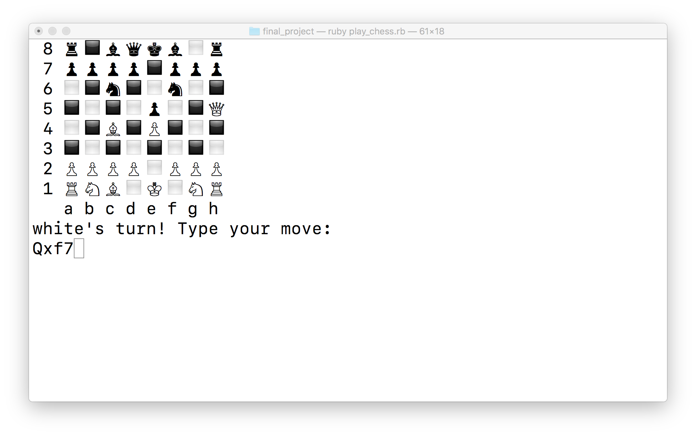
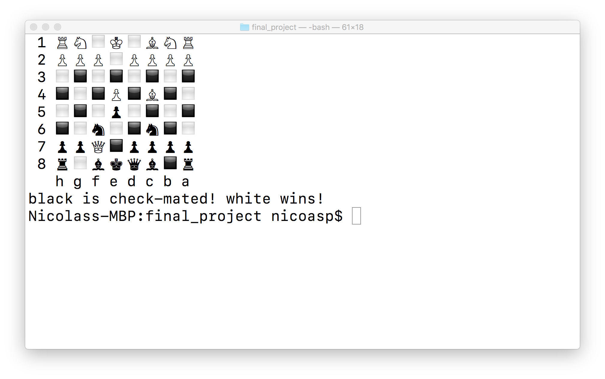

This is a project done as part of the learning curriculum "The Odin Project"
http://www.theodinproject.com/courses/ruby-programming/lessons/ruby-final-project

It's the final project of the "Ruby Programming" course: A full chess game for 2 players to play from the command line. Includes all special cases like en-passant moves or pawn promotion.

  
  

